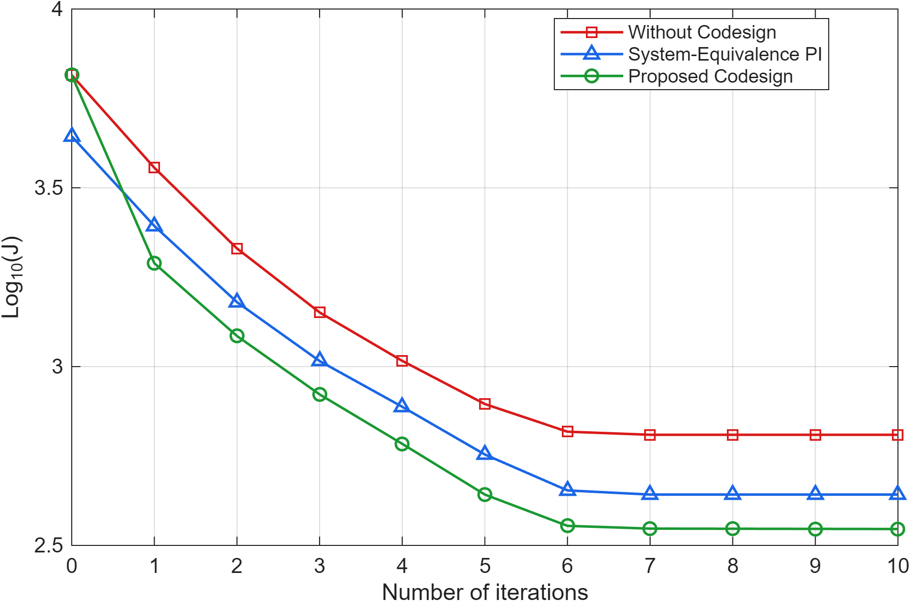
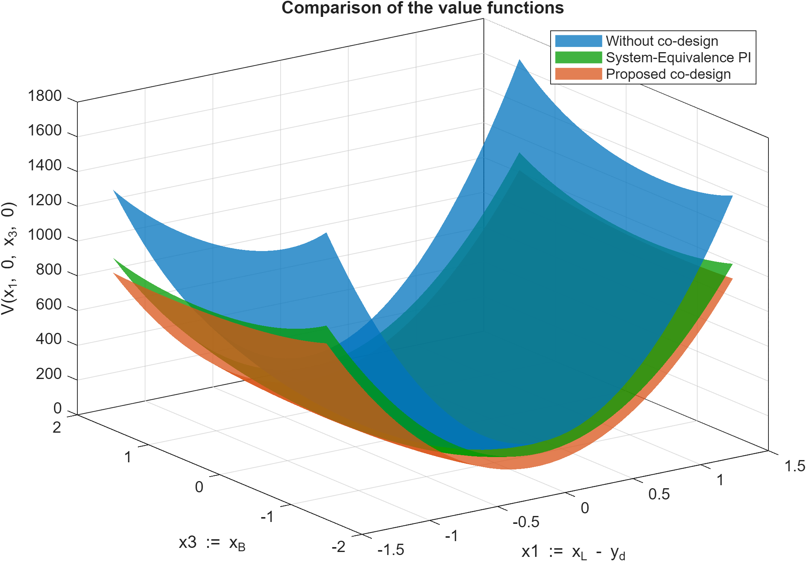
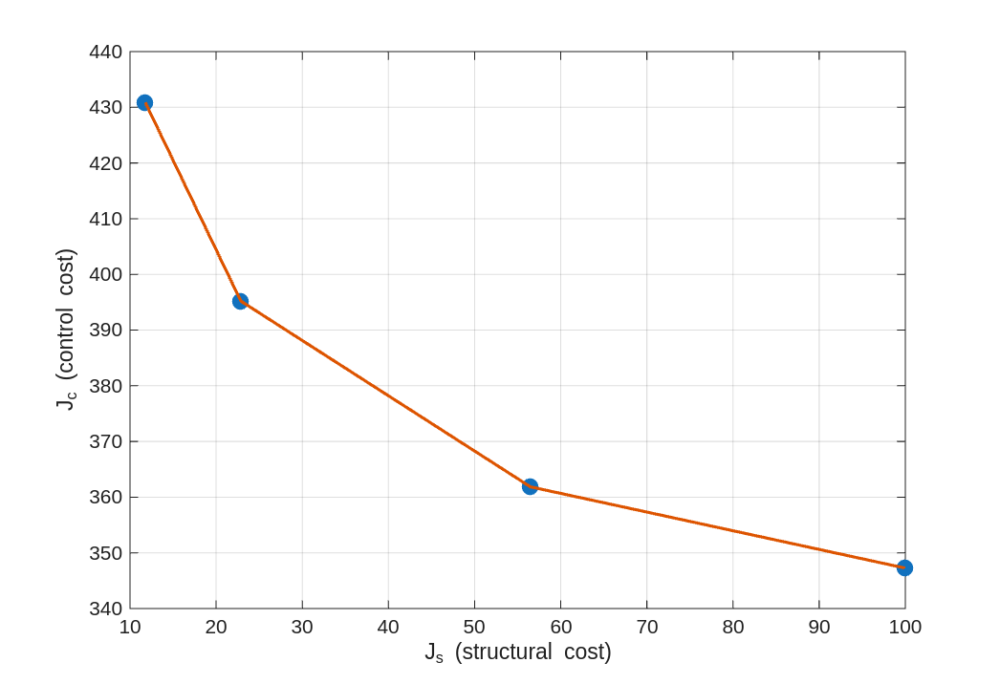

# Gradient-based Co-Design of Nonlinear Optimal Regulators

This repository provides the MATLAB implementation and numerical examples for the paper:

> H. Hoshino,  
> "*Gradient-based Co-Design of Nonlinear Optimal Regulators with Stability Guarantee*",  
> arXiv [[preprint]](link-to-pdf)

The code demonstrates the proposed **gradient-based co-design framework** that integrates:
- Galerkin approximations of the Hamilton–Jacobi–Bellman (HJB) equation,  
- Policy iteration for controller updates, and  
- Gradient-based updates of physical design parameters with admissibility checks for closed-loop stability.  

The benchmark system is a **nonlinear load-positioning system** introduced in [[Jiang et al., 2015]](https://doi.org/10.1109/TNNLS.2014.2382338).


## Results

This repository reproduces the numerical experiments in the paper using the nonlinear **load-positioning system** benchmark.

### Convergence of cost during iterations
The proposed co-design method (green) is compared with:
- **Policy iteration without co-design** (red),  
- **System-Equivalence-based Policy Iteration (SE-PI)** [Jiang et al., 2015] (blue).

As shown below, the proposed method achieves the lowest overall cost, resulting in ≈45% reduction compared to the initial controller and ≈20% reduction relative to SE-PI.



---

### Value function comparison
The Galerkin approximation allows us to visualize the approximate value function under different design updates.  
The proposed method improves the value function beyond SE-PI, while maintaining admissibility and closed-loop stability at each step.



---

### Pareto front between structural and control cost
We analyze the trade-off between the **structural cost** \(J_s\) and the **control cost** \(J_c\).  
By varying the weight parameter \(\alpha\), the proposed framework flexibly explores the Pareto front, while SE-PI is limited to improving control performance only.




## Requirements
- MATLAB (tested on R2025a)  
- Symbolic Math Toolbox (for basis function definitions)


## Usage
1. Clone this repository:
   ```bash
   git clone https://github.com/hoshino06/codesign_NOR.git
   cd codesign_NOR/codesign_NOR

2. Run the benchmark simulation:
   ```matlab
   >> main_load_positioning

3. To reproduce the Pareto front:
   ```matlab
   >> main_pareto_from_codesign

4. Use the plotting scripts (plot_comparison.m, plot_pareto.m, plot_value_function.m) to visualize the results.

